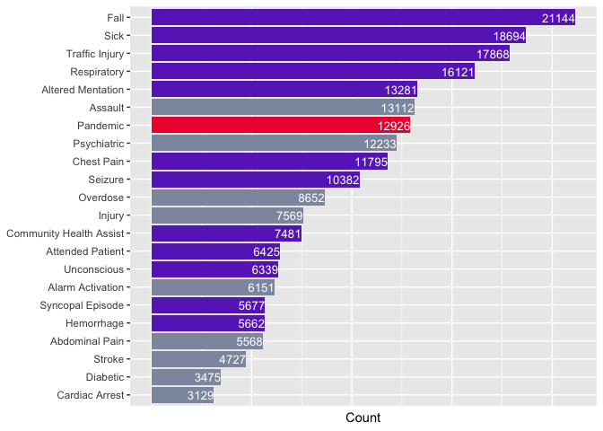
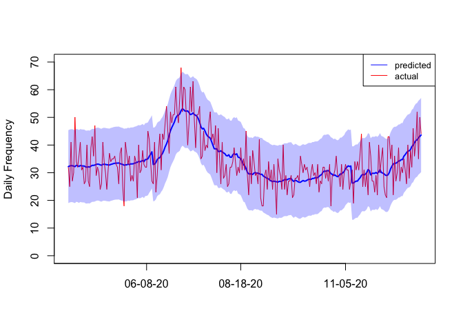

Predicting Covid-19 EMS Incidents from Daily Hospitalization Trends
================
Ngoc Mai Tran, Evdokia Nikolova, David Kulpanowski, Yangxinyu Xie,
Joshua Ong

Introduction: The aim of our retrospective study was to quantify the impact of Covid-19 on the temporal distribution of Emergency Medical Services (EMS) demand in Travis County, Austin, Texas and propose a robust model to forecast Covid-19 EMS incidents.

Methods: We analyzed the temporal distribution of EMS calls in the Austin-Travis County area between January 1st, 2019 and December 31st, 2020. Change point detection was performed to identify critical dates marking changes in EMS call distributions and time series regression was applied for forecasting Covid-19 EMS incidents.

Results: Two critical dates marked the impact of Covid-19 on the distribution of EMS calls: March 17th, when the daily number of non-pandemic EMS incidents dropped significantly, and May 13th, by which the daily number of EMS calls climbed back to 75% of the number in pre-Covid-19 time. New daily count of the hospitalization of Covid-19 patients alone proves a powerful predictor of the number of pandemic EMS calls, with an r2 value equal to 0.85. In particular, for every 2.5 cases where EMS takes a Covid-19 patient to a hospital, 1 person is admitted.

Conclusion: The mean daily number of non-pandemic EMS demand was significantly less than the period prior to Covid-19 pandemic. The number of EMS calls for Covid-19 symptoms can be predicted from the daily new hospitalization of Covid-19 patients. These findings may be of interest to EMS departments as they plan for future pandemics, including the ability to predict pandemic-related calls in an effort to adjust a targeted response.

## Load Incident Data

``` r
setwd("~/Desktop/ems/data/final")
rm(list = ls())
Incidents <- read.csv("Incidents2019_2020.csv")
ts.df <- read.csv("ts_2019_2020.csv")
nrow(Incidents)
```

    ## [1] 246809

## Basic Data Description

Call Disposition

``` r
library(ggplot2)
```

    ## Warning: package 'ggplot2' was built under R version 3.6.2

``` r
table_call <- summary(Incidents$Call_Disposition)
table_call <- table_call[table_call > 0]
s <- sum(table_call)
table_call <- data.frame(table_call[table_call > 5000])
colnames(table_call) <- "Count"
table_call$Percentage <- format(table_call$Count/s * 100, digits = 3)
table_call$Call_Disposition = row.names(table_call)

print("Proportion of the 6 major hospitals")
```

    ## [1] "Proportion of the 6 major hospitals"

``` r
sum(table_call[table_call$Call_Disposition %in% c("Dell Seton Med Ctr", "South Austin Hospital", "Saint Davids Med Ctr", "North Austin Hospital", "Seton Med Ctr", "Seton Northwest"),]$Count)/s
```

    ## [1] 0.4663161

``` r
colors <- c("Refusal" = "#575655", "Other" = "#575655", "Call Cancelled" = "#575655", "Referred" = "#575655",
            "No Patient" = "#575655", "Dell Seton Med Ctr" = "#029ac4", "North Austin Hospital" = "#029ac4", "Saint Davids Med Ctr" = "#029ac4", "Seton Med Ctr" = "#029ac4", "Seton Northwest" = "#029ac4", "South Austin Hospital" = "#029ac4")
g1 <- ggplot(data=table_call, aes(x=reorder(Call_Disposition, Count),y=Percentage, fill = Call_Disposition)) +
    scale_fill_manual(limits = c("Dell Seton Med Ctr", "South Austin Hospital", "Saint Davids Med Ctr", "North Austin Hospital", "Seton Med Ctr", "Seton Northwest", "Refusal", "Call Cancelled", "Referred", "No Patient", "Other"), values = colors) +
    geom_bar(position="dodge",stat="identity") + 
    geom_text(aes(label=Percentage), hjust=1, color="white", size=3.5) +
    theme(axis.title.y=element_blank(),
      axis.text.x=element_blank(),
        axis.ticks.x=element_blank(),
       legend.title = element_blank()) +
    coord_flip()
    print(g1)
```

<!-- -->

Major Problems

``` r
table <- summary(Incidents$Problem)
Problem_Highest_Freq = data.frame(table[table > 3000])
colnames(Problem_Highest_Freq) <- "Count"
Problem_Highest_Freq$Problem_Type = row.names(Problem_Highest_Freq)

colors <- c("Altered Mentation" = "#6930c3", 
            "Attended Patient" = "#6930c3", 
            "Chest Pain" = "#6930c3", 
            "Community Health Assist" = "#6930c3", 
            "Fall" = "#6930c3", 
            "Hemorrhage" = "#6930c3", 
            "Respiratory" = "#6930c3", 
            "Seizure" = "#6930c3", 
            "Sick" = "#6930c3", 
            "Syncopal Episode" = "#6930c3", 
            "Traffic Injury" = "#6930c3", 
            "Unconscious" = "#6930c3",
            "Pandemic" = "#ef233c",
            "Stroke" = "#8d99ae",
            "Abdominal Pain" = "#8d99ae",
            "Alarm Activation" = "#8d99ae",
            "Assault" = "#8d99ae",
            "Injury" = "#8d99ae",
            "Cardiac Arrest" = "#8d99ae",
            "Psychiatric" = "#8d99ae",
            "Overdose" = "#8d99ae", 
            "Diabetic" = "#8d99ae")


ggplot(data=Problem_Highest_Freq, aes(x=reorder(Problem_Type, Count),y=Count, fill = Problem_Type)) +
    scale_fill_manual(limits = c("Overdose", 
            "Diabetic", 
            "Altered Mentation", 
            "Attended Patient", 
            "Chest Pain", 
            "Community Health Assist", 
            "Fall", 
            "Hemorrhage", 
            "Respiratory", 
            "Seizure", 
            "Sick", 
            "Syncopal Episode", 
            "Traffic Injury", 
            "Unconscious",
            "Pandemic",
            "Stroke",
            "Abdominal Pain",
            "Alarm Activation",
            "Assault",
            "Injury",
            "Cardiac Arrest",
            "Psychiatric"), values = colors) +
    geom_bar(position="dodge",stat="identity") + 
    geom_text(aes(label=Count), hjust=1, color="white", size=3.5) +
    theme(axis.title.y=element_blank(),
      axis.text.x=element_blank(),
        axis.ticks.x=element_blank(),
       legend.title = element_blank()) +
    coord_flip() + theme(legend.position = "none")
```

<!-- -->

``` r
print("Proportion of the major problems")
```

    ## [1] "Proportion of the major problems"

``` r
sum(Problem_Highest_Freq$Count)/nrow(Incidents)
```

    ## [1] 0.8849394

Response time histogram

``` r
Incidents_assigned <- Incidents[Incidents$Time_First_Unit_Assigned >= 0 & !is.na(Incidents$Time_First_Unit_Assigned),]$Time_First_Unit_Assigned

Incidents_Enroute <- Incidents[Incidents$Time_First_Unit_Enroute >= 0 &!is.na(Incidents$Time_First_Unit_Enroute),]$Time_First_Unit_Enroute

Incidents_Arrived <- Incidents[Incidents$Time_First_Unit_Arrived >= 0 & !is.na(Incidents$Time_First_Unit_Arrived),]$Time_First_Unit_Arrived

par(mfrow=c(3,1))

hist(Incidents_assigned, xlim = c(0,5), breaks = max(Incidents_assigned)*20, xlab = "Assignment Time (minutes)", main = "")
legend("topright", legend=c("mean", "median"),
       col=c("blue", "purple"), lty = 1:2, cex=0.8)
abline(v=mean(Incidents_assigned), col="purple", lwd=2)
mean(Incidents_assigned)
```

    ## [1] 1.21057

``` r
abline(v=median(Incidents_assigned), col="blue", lwd=2, lty = 2)
median(Incidents_assigned)
```

    ## [1] 1.033333

``` r
hist(Incidents_Enroute, xlim = c(0,5), breaks = max(Incidents_Enroute)*20, xlab = "Dispatch Time (minutes)", main = "")
abline(v=mean(Incidents_Enroute), col="purple", lwd=2)
mean(Incidents_Enroute)
```

    ## [1] 1.047614

``` r
abline(v=median(Incidents_Enroute), col="blue", lwd=2, lty = 2)
median(Incidents_Enroute)
```

    ## [1] 1.05

``` r
hist(Incidents_Arrived, xlim = c(0,20), breaks = max(Incidents_Arrived)*20, xlab = "Arrival Time (minutes)", main = "")
abline(v=mean(Incidents_Arrived), col="purple", lwd=2)
mean(Incidents_Arrived)
```

    ## [1] 7.142607

``` r
abline(v=median(Incidents_Arrived), col="blue", lwd=2, lty = 2)
```

<!-- -->

``` r
median(Incidents_Arrived)
```

    ## [1] 6.1

Major hospital response time anova analysis.

``` r
library(gplots)
```

    ## 
    ## Attaching package: 'gplots'

    ## The following object is masked from 'package:stats':
    ## 
    ##     lowess

``` r
library(dplyr)
```

    ## Warning: package 'dplyr' was built under R version 3.6.2

    ## 
    ## Attaching package: 'dplyr'

    ## The following objects are masked from 'package:stats':
    ## 
    ##     filter, lag

    ## The following objects are masked from 'package:base':
    ## 
    ##     intersect, setdiff, setequal, union

``` r
print("Assignment Time")
```

    ## [1] "Assignment Time"

``` r
Incidents_assigned <- Incidents[Incidents$Time_First_Unit_Assigned >= 0 & !is.na(Incidents$Time_First_Unit_Assigned),]

Incidents_assigned_Major_hospital <- Incidents_assigned[Incidents_assigned$Call_Disposition %in% c("Dell Seton Med Ctr", "South Austin Hospital", "Saint Davids Med Ctr", "North Austin Hospital", "Seton Med Ctr", "Seton Northwest"),]

ggplot(Incidents_assigned_Major_hospital, aes(x=Call_Disposition, y=Time_First_Unit_Assigned)) +
  geom_violin(trim=FALSE) + stat_summary(fun=mean, geom="point", size=2, color="red") + 
  xlab("") + ylab("Assignment Time") + coord_flip() + ylim(0,5)
```

    ## Warning: Removed 432 rows containing non-finite values (stat_ydensity).

    ## Warning: Removed 432 rows containing non-finite values (stat_summary).

    ## Warning: Removed 212 rows containing missing values (geom_violin).

<!-- -->

``` r
Incidents_assigned_Major_hospital %>% group_by(Call_Disposition) %>% summarise(Mean=mean(Time_First_Unit_Assigned), Median=median(Time_First_Unit_Assigned))
```

    ## `summarise()` ungrouping output (override with `.groups` argument)

    ## # A tibble: 6 x 3
    ##   Call_Disposition       Mean Median
    ##   <fct>                 <dbl>  <dbl>
    ## 1 Dell Seton Med Ctr     1.16   1.03
    ## 2 North Austin Hospital  1.22   1.08
    ## 3 Saint Davids Med Ctr   1.22   1.08
    ## 4 Seton Med Ctr          1.23   1.08
    ## 5 Seton Northwest        1.26   1.12
    ## 6 South Austin Hospital  1.17   1.05

``` r
fit <- aov(Time_First_Unit_Assigned ~ Call_Disposition, data = Incidents_assigned_Major_hospital)
summary(fit)
```

    ##                      Df Sum Sq Mean Sq F value Pr(>F)    
    ## Call_Disposition      5    101  20.249    35.9 <2e-16 ***
    ## Residuals        115019  64884   0.564                   
    ## ---
    ## Signif. codes:  0 '***' 0.001 '**' 0.01 '*' 0.05 '.' 0.1 ' ' 1

``` r
print("Dispatch Time")
```

    ## [1] "Dispatch Time"

``` r
Incidents_Enroute <- Incidents[Incidents$Time_First_Unit_Enroute >= 0 &!is.na(Incidents$Time_First_Unit_Enroute),]

Incidents_Enroute_Major_hospital <- Incidents_Enroute[Incidents_Enroute$Call_Disposition %in% c("Dell Seton Med Ctr", "South Austin Hospital", "Saint Davids Med Ctr", "North Austin Hospital", "Seton Med Ctr", "Seton Northwest"),]

ggplot(Incidents_Enroute_Major_hospital, aes(x=Call_Disposition, y=Time_First_Unit_Enroute)) +
  geom_violin(trim=FALSE) + stat_summary(fun=mean, geom="point", size=2, color="red") +
  xlab("") + ylab("Dispatch Time") + coord_flip() + ylim(0,5)
```

    ## Warning: Removed 77 rows containing non-finite values (stat_ydensity).

    ## Warning: Removed 77 rows containing non-finite values (stat_summary).

    ## Warning: Removed 242 rows containing missing values (geom_violin).

<!-- -->

``` r
Incidents_Enroute_Major_hospital %>% group_by(Call_Disposition) %>% summarise(Mean=mean(Time_First_Unit_Enroute), Median=median(Time_First_Unit_Enroute))
```

    ## `summarise()` ungrouping output (override with `.groups` argument)

    ## # A tibble: 6 x 3
    ##   Call_Disposition       Mean Median
    ##   <fct>                 <dbl>  <dbl>
    ## 1 Dell Seton Med Ctr    0.976   1   
    ## 2 North Austin Hospital 1.07    1.08
    ## 3 Saint Davids Med Ctr  1.01    1.03
    ## 4 Seton Med Ctr         1.04    1.07
    ## 5 Seton Northwest       1.11    1.13
    ## 6 South Austin Hospital 1.04    1.07

``` r
fit <- aov(Time_First_Unit_Enroute ~ Call_Disposition, data = Incidents_Enroute_Major_hospital)
summary(fit)
```

    ##                      Df Sum Sq Mean Sq F value Pr(>F)    
    ## Call_Disposition      5    179   35.90   75.71 <2e-16 ***
    ## Residuals        114873  54468    0.47                   
    ## ---
    ## Signif. codes:  0 '***' 0.001 '**' 0.01 '*' 0.05 '.' 0.1 ' ' 1

``` r
print("Arrival Time")
```

    ## [1] "Arrival Time"

``` r
Incidents_Arrived <- Incidents[Incidents$Time_First_Unit_Arrived >= 0 & !is.na(Incidents$Time_First_Unit_Arrived),]

Incidents_Arrived_Major_hospital <- Incidents_Arrived[Incidents_Arrived$Call_Disposition %in% c("Dell Seton Med Ctr", "South Austin Hospital", "Saint Davids Med Ctr", "North Austin Hospital", "Seton Med Ctr", "Seton Northwest"),]

ggplot(Incidents_Arrived_Major_hospital, aes(x=Call_Disposition, y=Time_First_Unit_Arrived)) +
  geom_violin(trim=FALSE) + stat_summary(fun=mean, geom="point", size=2, color="red") + 
  xlab("") + ylab("Arrival Time") + coord_flip() + ylim(0,30)
```

    ## Warning: Removed 271 rows containing non-finite values (stat_ydensity).

    ## Warning: Removed 271 rows containing non-finite values (stat_summary).

    ## Warning: Removed 203 rows containing missing values (geom_violin).

<!-- -->

``` r
Incidents_Arrived_Major_hospital %>% group_by(Call_Disposition) %>% summarise(Mean=mean(Time_First_Unit_Arrived), Median=median(Time_First_Unit_Arrived))
```

    ## `summarise()` ungrouping output (override with `.groups` argument)

    ## # A tibble: 6 x 3
    ##   Call_Disposition       Mean Median
    ##   <fct>                 <dbl>  <dbl>
    ## 1 Dell Seton Med Ctr     6.34   5.57
    ## 2 North Austin Hospital  6.97   6.2 
    ## 3 Saint Davids Med Ctr   6.61   5.88
    ## 4 Seton Med Ctr          7.02   6.27
    ## 5 Seton Northwest        6.79   6.07
    ## 6 South Austin Hospital  7.17   6.3

``` r
fit <- aov(Time_First_Unit_Arrived ~ Call_Disposition, data = Incidents_Arrived_Major_hospital)
summary(fit)
```

    ##                      Df  Sum Sq Mean Sq F value Pr(>F)    
    ## Call_Disposition      5   13070  2614.0   49.19 <2e-16 ***
    ## Residuals        114593 6089091    53.1                   
    ## ---
    ## Signif. codes:  0 '***' 0.001 '**' 0.01 '*' 0.05 '.' 0.1 ' ' 1

``` r
plotmeans(Time_First_Unit_Assigned ~ Call_Disposition, data = Incidents_assigned_Major_hospital, xlab="Hospital", cex.axis = 0.5, ylab="Assignment Time(minutes)", 
             main="Mean Plot with 95% CI")
```

<!-- -->

``` r
plotmeans(Time_First_Unit_Enroute ~ Call_Disposition, data = Incidents_Enroute_Major_hospital, xlab="Hospital", cex.axis = 0.5, ylab="Dispatch Time(minutes)", 
             main="Mean Plot with 95% CI")
```

<!-- -->

``` r
plotmeans(Time_First_Unit_Arrived ~ Call_Disposition, data = Incidents_Arrived_Major_hospital, xlab="Hospital", cex.axis = 0.5, ylab="Arrival Time(minutes)", 
             main="Mean Plot with 95% CI")
```

<!-- -->

## Time Series Data Processing

to\_daily\_ts is a function that converts incidents data into daily
counts.

``` r
library(stats)
library(forecast)
```

    ## Warning: package 'forecast' was built under R version 3.6.2

    ## Registered S3 method overwritten by 'quantmod':
    ##   method            from
    ##   as.zoo.data.frame zoo

``` r
library(car)
```

    ## Loading required package: carData

    ## 
    ## Attaching package: 'car'

    ## The following object is masked from 'package:dplyr':
    ## 
    ##     recode

``` r
library(astsa)
```

    ## Warning: package 'astsa' was built under R version 3.6.2

    ## 
    ## Attaching package: 'astsa'

    ## The following object is masked from 'package:forecast':
    ## 
    ##     gas

``` r
library(nlme)
```

    ## 
    ## Attaching package: 'nlme'

    ## The following object is masked from 'package:forecast':
    ## 
    ##     getResponse

    ## The following object is masked from 'package:dplyr':
    ## 
    ##     collapse

``` r
library(gridExtra)
```

    ## 
    ## Attaching package: 'gridExtra'

    ## The following object is masked from 'package:dplyr':
    ## 
    ##     combine

``` r
library(TSA)
```

    ## Warning: package 'TSA' was built under R version 3.6.2

    ## Registered S3 methods overwritten by 'TSA':
    ##   method       from    
    ##   fitted.Arima forecast
    ##   plot.Arima   forecast

    ## 
    ## Attaching package: 'TSA'

    ## The following objects are masked from 'package:stats':
    ## 
    ##     acf, arima

    ## The following object is masked from 'package:utils':
    ## 
    ##     tar

``` r
library(xts)
```

    ## Loading required package: zoo

    ## 
    ## Attaching package: 'zoo'

    ## The following objects are masked from 'package:base':
    ## 
    ##     as.Date, as.Date.numeric

    ## 
    ## Attaching package: 'xts'

    ## The following objects are masked from 'package:dplyr':
    ## 
    ##     first, last

``` r
library(ggplot2)
library(lubridate)
```

    ## 
    ## Attaching package: 'lubridate'

    ## The following object is masked from 'package:base':
    ## 
    ##     date

``` r
library(tseries)
last_day <- as.Date("2020-12-31")
first_day <- as.Date("2019/01/01")
```

Time series of overall EMS calls.

``` r
total_ts <- ts(ts.df$total_ts, start = first_day)
summary(total_ts)
```

    ##    Min. 1st Qu.  Median    Mean 3rd Qu.    Max. 
    ##   233.0   313.5   338.0   337.6   359.0   592.0

``` r
sd(total_ts)
```

    ## [1] 34.24033

Time series of non-pandemic defunct EMS calls and pandemic defunct EMS
calls.

``` r
defunct_calls_pandemic_removed_ts <- ts(ts.df$defunct_calls_pandemic_removed_ts, start = first_day)
Pandemic_defunct_calls_ts <- ts(ts.df$Pandemic_defunct_calls_ts, start = first_day)
```

Time series of non-pandemic EMS calls and pandemic EMS calls.

``` r
Incidents_pandemic_removed_ts <- ts(ts.df$Incidents_pandemic_removed_ts, start = first_day)
Pandemic_effect_ts <- ts(ts.df$Pandemic_effect_ts, start = first_day)
```

Time series of daily Covid-19 hospitalization data.

``` r
hospitalisation_ts <- ts(ts.df$hospitalisation_ts, start = first_day)
```

Create smoothed time series.

``` r
library(changepoint.np)
```

    ## Warning: package 'changepoint.np' was built under R version 3.6.2

    ## Loading required package: changepoint

    ## Successfully loaded changepoint package version 2.2.2
    ##  NOTE: Predefined penalty values changed in version 2.2.  Previous penalty values with a postfix 1 i.e. SIC1 are now without i.e. SIC and previous penalties without a postfix i.e. SIC are now with a postfix 0 i.e. SIC0. See NEWS and help files for further details.

``` r
library(tseries)
library(MTS)
library(ppcor)
```

    ## Loading required package: MASS

    ## 
    ## Attaching package: 'MASS'

    ## The following object is masked from 'package:dplyr':
    ## 
    ##     select

``` r
last_day_int <- as.numeric(last_day - first_day) + 1
first_day_int <- 7

# start is the start day of the smoothing, it is also used as an averaging denominator
# end is the last day of the data
smooth_ts <- function(data, start, end){
  smoothed_data_ts <- c()
  for (i in start:end){
    begin = i - start + 1
    smoothed_data_ts <- c(smoothed_data_ts,mean(data[c(begin: (begin + start - 1))]))
  }
  for (j in start - 2:ceiling(start/2)){
    begin = end - j
    smoothed_data_ts <- c(smoothed_data_ts,mean(data[c(begin : end)]))
  }
  return(ts(smoothed_data_ts, start = first_day + floor(start/2)))
}

smoothed_Incidents_pandemic_removed_ts <- smooth_ts(Incidents_pandemic_removed_ts, start = first_day_int, end = last_day_int)
smoothed_Pandemic_effect_ts <- smooth_ts(Pandemic_effect_ts, start = first_day_int, end = last_day_int)

smoothed_defunct_calls_pandemic_removed_ts <- smooth_ts(defunct_calls_pandemic_removed_ts, start = first_day_int, end = last_day_int)
smoothed_Pandemic_defunct_calls_ts <- smooth_ts(Pandemic_defunct_calls_ts, start = first_day_int, end = last_day_int)

smoothed_hospitalisation_ts <- smooth_ts(hospitalisation_ts, start = first_day_int, end = last_day_int)
```

## Impact of the pandemic

Change point detection on non-pandemic incident time series.

``` r
tt <- time(Incidents_pandemic_removed_ts)
fmt <- "%m-%d-%y" # format for axis labels
raw.man=cpt.meanvar(Incidents_pandemic_removed_ts,method='BinSeg',penalty='BIC',test.stat='Normal', Q = 2)
```

    ## Warning in BINSEG(sumstat, pen = pen.value, cost_func = costfunc, minseglen
    ## = minseglen, : The number of changepoints identified is Q, it is advised to
    ## increase Q to make sure changepoints have not been missed.

``` r
first_day + cpts(raw.man) - 1
```

    ## [1] "2020-03-17" "2020-05-13"

``` r
## Comparing with other penalty types and methods
for (penalty_ in c('BIC', 'SIC', 'MBIC', 'AIC')){
  raw.man1=cpt.meanvar(Incidents_pandemic_removed_ts,method='BinSeg',penalty=penalty_,
                       pen.value=c(log(length(Incidents_pandemic_removed_ts)),100*log(length(Incidents_pandemic_removed_ts))), test.stat='Normal', Q = 10)
  print(first_day + cpts(raw.man1) - 1)
}
```

    ## [1] "2019-03-06" "2019-10-23" "2020-03-17" "2020-04-08" "2020-05-13"
    ## [1] "2019-03-06" "2019-10-23" "2020-03-17" "2020-04-08" "2020-05-13"
    ## [1] "2019-03-06" "2020-03-17" "2020-04-08" "2020-05-13"

    ## Warning in BINSEG(sumstat, pen = pen.value, cost_func = costfunc, minseglen
    ## = minseglen, : The number of changepoints identified is Q, it is advised to
    ## increase Q to make sure changepoints have not been missed.

    ##  [1] "2019-01-04" "2019-01-24" "2019-03-01" "2019-03-06" "2019-07-29"
    ##  [6] "2019-10-23" "2020-03-17" "2020-04-08" "2020-05-13" "2020-09-28"

``` r
for (penalty_ in c('BIC', 'SIC', 'MBIC', 'AIC')){
  raw.man1=cpt.meanvar(Incidents_pandemic_removed_ts,method='PELT',penalty=penalty_, test.stat='Normal')

  print(first_day + cpts(raw.man1) - 1)
}
```

    ##  [1] "2019-01-25" "2019-01-27" "2019-05-07" "2019-05-09" "2019-08-01"
    ##  [6] "2019-08-03" "2019-09-27" "2019-09-29" "2019-10-13" "2019-10-15"
    ## [11] "2019-12-08" "2019-12-10" "2020-02-25" "2020-02-27" "2020-03-17"
    ## [16] "2020-04-08" "2020-05-20" "2020-05-22" "2020-08-10" "2020-08-12"
    ## [21] "2020-09-24" "2020-09-26" "2020-10-20" "2020-10-22" "2020-11-27"
    ## [26] "2020-11-29" "2020-12-06" "2020-12-08"
    ##  [1] "2019-01-25" "2019-01-27" "2019-05-07" "2019-05-09" "2019-08-01"
    ##  [6] "2019-08-03" "2019-09-27" "2019-09-29" "2019-10-13" "2019-10-15"
    ## [11] "2019-12-08" "2019-12-10" "2020-02-25" "2020-02-27" "2020-03-17"
    ## [16] "2020-04-08" "2020-05-20" "2020-05-22" "2020-08-10" "2020-08-12"
    ## [21] "2020-09-24" "2020-09-26" "2020-10-20" "2020-10-22" "2020-11-27"
    ## [26] "2020-11-29" "2020-12-06" "2020-12-08"
    ##  [1] "2019-01-25" "2019-01-27" "2019-05-07" "2019-05-09" "2019-08-01"
    ##  [6] "2019-08-03" "2019-09-27" "2019-09-29" "2019-10-13" "2019-10-15"
    ## [11] "2019-12-08" "2019-12-10" "2020-02-25" "2020-02-27" "2020-03-17"
    ## [16] "2020-04-08" "2020-05-20" "2020-05-22" "2020-08-10" "2020-08-12"
    ## [21] "2020-09-24" "2020-09-26" "2020-10-20" "2020-10-22" "2020-11-27"
    ## [26] "2020-11-29" "2020-12-06" "2020-12-08"
    ##   [1] "2019-01-02" "2019-01-04" "2019-01-06" "2019-01-09" "2019-01-11"
    ##   [6] "2019-01-25" "2019-01-27" "2019-02-01" "2019-02-03" "2019-02-08"
    ##  [11] "2019-02-11" "2019-02-16" "2019-02-18" "2019-03-01" "2019-03-03"
    ##  [16] "2019-03-05" "2019-03-07" "2019-03-09" "2019-03-14" "2019-03-18"
    ##  [21] "2019-03-23" "2019-03-28" "2019-04-03" "2019-04-09" "2019-04-12"
    ##  [26] "2019-04-15" "2019-04-18" "2019-04-20" "2019-04-22" "2019-04-26"
    ##  [31] "2019-04-28" "2019-04-30" "2019-05-02" "2019-05-05" "2019-05-07"
    ##  [36] "2019-05-09" "2019-05-21" "2019-05-26" "2019-05-30" "2019-06-09"
    ##  [41] "2019-06-11" "2019-06-16" "2019-06-18" "2019-06-20" "2019-07-29"
    ##  [46] "2019-08-01" "2019-08-03" "2019-08-23" "2019-08-25" "2019-08-27"
    ##  [51] "2019-09-03" "2019-09-05" "2019-09-07" "2019-09-27" "2019-09-29"
    ##  [56] "2019-10-11" "2019-10-13" "2019-10-15" "2019-10-20" "2019-10-23"
    ##  [61] "2019-10-26" "2019-10-30" "2019-11-04" "2019-11-06" "2019-11-09"
    ##  [66] "2019-11-11" "2019-12-08" "2019-12-10" "2019-12-12" "2019-12-14"
    ##  [71] "2019-12-16" "2019-12-19" "2019-12-21" "2019-12-23" "2019-12-25"
    ##  [76] "2020-01-13" "2020-01-15" "2020-01-18" "2020-01-31" "2020-02-19"
    ##  [81] "2020-02-21" "2020-02-23" "2020-02-25" "2020-02-27" "2020-02-29"
    ##  [86] "2020-03-02" "2020-03-07" "2020-03-09" "2020-03-12" "2020-03-17"
    ##  [91] "2020-03-23" "2020-03-26" "2020-03-30" "2020-04-02" "2020-04-08"
    ##  [96] "2020-04-11" "2020-04-13" "2020-05-04" "2020-05-06" "2020-05-08"
    ## [101] "2020-05-11" "2020-05-13" "2020-05-16" "2020-05-18" "2020-05-20"
    ## [106] "2020-05-22" "2020-05-24" "2020-05-27" "2020-05-29" "2020-06-01"
    ## [111] "2020-06-03" "2020-06-05" "2020-06-07" "2020-06-09" "2020-06-12"
    ## [116] "2020-06-15" "2020-06-17" "2020-06-19" "2020-06-22" "2020-06-27"
    ## [121] "2020-06-29" "2020-07-02" "2020-07-04" "2020-07-07" "2020-07-13"
    ## [126] "2020-07-15" "2020-07-20" "2020-07-22" "2020-07-25" "2020-07-27"
    ## [131] "2020-07-29" "2020-07-31" "2020-08-05" "2020-08-07" "2020-08-10"
    ## [136] "2020-08-12" "2020-08-16" "2020-08-27" "2020-09-19" "2020-09-24"
    ## [141] "2020-09-26" "2020-10-01" "2020-10-06" "2020-10-09" "2020-10-11"
    ## [146] "2020-10-13" "2020-10-20" "2020-10-22" "2020-10-24" "2020-11-05"
    ## [151] "2020-11-07" "2020-11-21" "2020-11-23" "2020-11-27" "2020-11-29"
    ## [156] "2020-12-03" "2020-12-06" "2020-12-08" "2020-12-18" "2020-12-22"

``` r
for (penalty_ in c('BIC', 'SIC', 'MBIC', 'AIC')){
  raw.man1=cpt.var(Incidents_pandemic_removed_ts,method='PELT',penalty=penalty_, test.stat='Normal')

  print(first_day + cpts(raw.man1) - 1)
}
```

    ## [1] "2019-03-07" "2020-04-08" "2020-05-13"
    ## [1] "2019-03-07" "2020-04-08" "2020-05-13"
    ## [1] "2019-03-07"
    ##  [1] "2019-03-03" "2019-03-05" "2019-04-15" "2019-04-18" "2019-07-22"
    ##  [6] "2019-07-25" "2019-10-23" "2019-10-30" "2019-11-09" "2019-11-11"
    ## [11] "2020-01-31" "2020-02-18" "2020-03-30" "2020-05-13"

Change point statistics and time series plot

``` r
param.est(raw.man)
```

    ## $mean
    ## [1] 225.6900 155.8421 169.5259
    ## 
    ## $variance
    ## [1] 377.4944 409.3259 217.8442

``` r
print("Standard Deviation")
```

    ## [1] "Standard Deviation"

``` r
sqrt(param.est(raw.man)$variance)
```

    ## [1] 19.42922 20.23181 14.75954

``` r
print("Change point Dates")
```

    ## [1] "Change point Dates"

``` r
first_day + cpts(raw.man) - 1
```

    ## [1] "2020-03-17" "2020-05-13"

``` r
labs <- format(as.Date(tt[cpts(raw.man)]), fmt)
plot(raw.man,cpt.width=3, ylab = "Daily Frequency", xaxt ="n", main = "Non-Pandemic EMS Incidents", xlab = "")
axis(side = 1, at = tt[cpts(raw.man)], labels = labs,  cex.axis = 0.5)
```

<!-- -->

``` r
param.est(raw.man)$mean[3]/param.est(raw.man)$mean[1]
```

    ## [1] 0.7511446

``` r
plot(Incidents_pandemic_removed_ts, xaxt ="n", ylim = c(0, 350), ylab = "Daily Frequency", 
     col = alpha("black", 0.2))
lines(smoothed_Incidents_pandemic_removed_ts, col = "black")
lines(defunct_calls_pandemic_removed_ts,col = alpha("orange", 0.2))
lines(smoothed_defunct_calls_pandemic_removed_ts, col = "orange")
lines(Pandemic_effect_ts,col = alpha("red", 0.2))
lines(smoothed_Pandemic_effect_ts, col = "red")
lines(Pandemic_defunct_calls_ts,col = alpha("brown", 0.2))
lines(smoothed_Pandemic_defunct_calls_ts, col = "brown")
lines(hospitalisation_ts, col = alpha("green", 0.2))
lines(smoothed_hospitalisation_ts, col = "green")
tt <- time(Incidents_pandemic_removed_ts)
for (i in tt[cpts(raw.man)]){
  abline(v=i, col="purple", lwd=2)
}
ix <- seq(1, length(tt), by=50)
fmt <- "%m-%d-%y" # format for axis labels
labs <- format(as.Date(tt[cpts(raw.man)]), fmt)
axis(side = 1, at = tt[cpts(raw.man)], labels = labs, cex.axis = 0.5)
legend("topleft", legend=c("Pandemic Effect", "Pandemic Defunct", "Non-pandemic Defunct"),
       col=c("red", "brown","orange"),lty=1, cex=0.8)
legend("topright", legend=c("Hospitalization", "Non-pandemic Effect"),
       col=c("green", "black"),lty=1, cex=0.8)
```

<!-- -->

Comparison of number of Non-Pandemic Defunct EMS incidents per day among
Period 1 (before March 17th), Period 2 (March 18th - May 12th), Period 3
(after May 13th). (Table 4 in the paper.)

``` r
print("Change points")
```

    ## [1] "Change points"

``` r
cpts(raw.man)
```

    ## [1] 442 499

``` r
print("n of period 2 and 3")
```

    ## [1] "n of period 2 and 3"

``` r
length(defunct_calls_pandemic_removed_ts[(cpts(raw.man)[1] + 1):(cpts(raw.man)[2] - 1)])
```

    ## [1] 56

``` r
length(defunct_calls_pandemic_removed_ts[cpts(raw.man)[2]:last_day_int])
```

    ## [1] 233

``` r
print("Mean: period 1, 2 and 3")
```

    ## [1] "Mean: period 1, 2 and 3"

``` r
mean(defunct_calls_pandemic_removed_ts[1:cpts(raw.man)[1]])
```

    ## [1] 122.3462

``` r
mean(defunct_calls_pandemic_removed_ts[(cpts(raw.man)[1] + 1):(cpts(raw.man)[2] - 1)])
```

    ## [1] 113.5893

``` r
mean(defunct_calls_pandemic_removed_ts[cpts(raw.man)[2]:last_day_int])
```

    ## [1] 109.3433

``` r
print("sd: period 1, 2 and 3")
```

    ## [1] "sd: period 1, 2 and 3"

``` r
sd(defunct_calls_pandemic_removed_ts[1:cpts(raw.man)[1]])
```

    ## [1] 21.71324

``` r
sd(defunct_calls_pandemic_removed_ts[(cpts(raw.man)[1] + 1):(cpts(raw.man)[2] - 1)])
```

    ## [1] 19.30405

``` r
sd(defunct_calls_pandemic_removed_ts[cpts(raw.man)[2]:last_day_int])
```

    ## [1] 12.73038

``` r
print("Proportion of nonpandemic defunct calls pre (period 1) and post covid(period 3)")
```

    ## [1] "Proportion of nonpandemic defunct calls pre (period 1) and post covid(period 3)"

``` r
sum(defunct_calls_pandemic_removed_ts[1:442]) / sum(Incidents_pandemic_removed_ts[1:442] + defunct_calls_pandemic_removed_ts[1:442])
```

    ## [1] 0.3515328

``` r
sum(defunct_calls_pandemic_removed_ts[499:last_day_int]) / sum(Incidents_pandemic_removed_ts[499:last_day_int] + defunct_calls_pandemic_removed_ts[499:last_day_int])
```

    ## [1] 0.3922375

``` r
mean(defunct_calls_pandemic_removed_ts[1:442] / (Incidents_pandemic_removed_ts[1:442] + defunct_calls_pandemic_removed_ts[1:442]))
```

    ## [1] 0.3501695

``` r
mean(defunct_calls_pandemic_removed_ts[499:last_day_int] / (Incidents_pandemic_removed_ts[499:last_day_int] + defunct_calls_pandemic_removed_ts[499:last_day_int]))
```

    ## [1] 0.3919729

Major problems impacted by the pandemic.

``` r
problem_ts <- function(data){
  to_daily_ts <- c()
  for (i in first_day:last_day){
    subset <- as.Date(data$Time_PhonePickUp_Date) == as.Date(i)
    data = data[!subset,]
    to_daily_ts <- c(to_daily_ts, sum(subset))
  }
  return(to_daily_ts)
}

problem_TS_Plot <- function(Problem_Type){
  
  Problem_DF <- data.frame()
  
  for (problem in Problem_Type){
    data <- Incidents[Incidents$Problem %in% problem,]
    df <- data.frame(problem_ts(data))
    colnames(df) <- "Daily_Count"
    df$Problem_Type <- problem
    Problem_DF <- rbind(Problem_DF, df)
  }

  return(Problem_DF)
}

Problem_DF <- problem_TS_Plot(Problem_Highest_Freq$Problem_Type)

for (problem in Problem_Highest_Freq$Problem_Type){
  data <- Problem_DF[Problem_DF$Problem_Type == problem,]$Daily_Count
  before <- data[1:cpts(raw.man)[1]]
  mid <- data[(cpts(raw.man)[1] + 1): (cpts(raw.man)[2] - 1)]
  after <- data[cpts(raw.man)[2]:last_day_int]
  print(problem)
  print(t.test(before, after, alternative = "greater"))
  print(mean(mid))
}
```

    ## [1] "Abdominal Pain"
    ## 
    ##  Welch Two Sample t-test
    ## 
    ## data:  before and after
    ## t = 0.61115, df = 488.58, p-value = 0.2707
    ## alternative hypothesis: true difference in means is greater than 0
    ## 95 percent confidence interval:
    ##  -0.2385689        Inf
    ## sample estimates:
    ## mean of x mean of y 
    ##  7.647059  7.506438 
    ## 
    ## [1] 7.839286
    ## [1] "Alarm Activation"
    ## 
    ##  Welch Two Sample t-test
    ## 
    ## data:  before and after
    ## t = 1.139, df = 480.49, p-value = 0.1276
    ## alternative hypothesis: true difference in means is greater than 0
    ## 95 percent confidence interval:
    ##  -0.1279704        Inf
    ## sample estimates:
    ## mean of x mean of y 
    ##   8.51810   8.23176 
    ## 
    ## [1] 8.357143
    ## [1] "Altered Mentation"
    ## 
    ##  Welch Two Sample t-test
    ## 
    ## data:  before and after
    ## t = 19.035, df = 591.84, p-value < 2.2e-16
    ## alternative hypothesis: true difference in means is greater than 0
    ## 95 percent confidence interval:
    ##  6.157981      Inf
    ## sample estimates:
    ## mean of x mean of y 
    ##  20.89593  14.15451 
    ## 
    ## [1] 13.33929
    ## [1] "Assault"
    ## 
    ##  Welch Two Sample t-test
    ## 
    ## data:  before and after
    ## t = -1.3037, df = 506.84, p-value = 0.9035
    ## alternative hypothesis: true difference in means is greater than 0
    ## 95 percent confidence interval:
    ##  -1.338337       Inf
    ## sample estimates:
    ## mean of x mean of y 
    ##  17.85520  18.44635 
    ## 
    ## [1] 16.46429
    ## [1] "Attended Patient"
    ## 
    ##  Welch Two Sample t-test
    ## 
    ## data:  before and after
    ## t = 12.804, df = 634.16, p-value < 2.2e-16
    ## alternative hypothesis: true difference in means is greater than 0
    ## 95 percent confidence interval:
    ##  3.310205      Inf
    ## sample estimates:
    ## mean of x mean of y 
    ## 10.429864  6.630901 
    ## 
    ## [1] 4.821429
    ## [1] "Cardiac Arrest"
    ## 
    ##  Welch Two Sample t-test
    ## 
    ## data:  before and after
    ## t = -2.9968, df = 435.57, p-value = 0.9986
    ## alternative hypothesis: true difference in means is greater than 0
    ## 95 percent confidence interval:
    ##  -0.7754572        Inf
    ## sample estimates:
    ## mean of x mean of y 
    ##  4.036199  4.536481 
    ## 
    ## [1] 5.142857
    ## [1] "Chest Pain"
    ## 
    ##  Welch Two Sample t-test
    ## 
    ## data:  before and after
    ## t = 25.936, df = 570.11, p-value < 2.2e-16
    ## alternative hypothesis: true difference in means is greater than 0
    ## 95 percent confidence interval:
    ##  7.562509      Inf
    ## sample estimates:
    ## mean of x mean of y 
    ##  19.17421  11.09871 
    ## 
    ## [1] 13.10714
    ## [1] "Community Health Assist"
    ## 
    ##  Welch Two Sample t-test
    ## 
    ## data:  before and after
    ## t = 6.624, df = 621.6, p-value = 3.789e-11
    ## alternative hypothesis: true difference in means is greater than 0
    ## 95 percent confidence interval:
    ##  2.630343      Inf
    ## sample estimates:
    ## mean of x mean of y 
    ## 11.561086  8.060086 
    ## 
    ## [1] 8.803571
    ## [1] "Diabetic"
    ## 
    ##  Welch Two Sample t-test
    ## 
    ## data:  before and after
    ## t = 2.4616, df = 517.2, p-value = 0.007079
    ## alternative hypothesis: true difference in means is greater than 0
    ## 95 percent confidence interval:
    ##  0.152363      Inf
    ## sample estimates:
    ## mean of x mean of y 
    ##  4.907240  4.446352 
    ## 
    ## [1] 4.821429
    ## [1] "Fall"
    ## 
    ##  Welch Two Sample t-test
    ## 
    ## data:  before and after
    ## t = 6.7414, df = 468.33, p-value = 2.314e-11
    ## alternative hypothesis: true difference in means is greater than 0
    ## 95 percent confidence interval:
    ##  2.414405      Inf
    ## sample estimates:
    ## mean of x mean of y 
    ##  30.46606  27.27039 
    ## 
    ## [1] 23.64286
    ## [1] "Hemorrhage"
    ## 
    ##  Welch Two Sample t-test
    ## 
    ## data:  before and after
    ## t = 8.9221, df = 538.68, p-value < 2.2e-16
    ## alternative hypothesis: true difference in means is greater than 0
    ## 95 percent confidence interval:
    ##  1.653777      Inf
    ## sample estimates:
    ## mean of x mean of y 
    ##  8.509050  6.480687 
    ## 
    ## [1] 6.982143
    ## [1] "Injury"
    ## 
    ##  Welch Two Sample t-test
    ## 
    ## data:  before and after
    ## t = 1.5516, df = 503.86, p-value = 0.06069
    ## alternative hypothesis: true difference in means is greater than 0
    ## 95 percent confidence interval:
    ##  -0.02690322         Inf
    ## sample estimates:
    ## mean of x mean of y 
    ##  10.66968  10.23605 
    ## 
    ## [1] 8.357143
    ## [1] "Overdose"
    ## 
    ##  Welch Two Sample t-test
    ## 
    ## data:  before and after
    ## t = 2.4393, df = 472.63, p-value = 0.007541
    ## alternative hypothesis: true difference in means is greater than 0
    ## 95 percent confidence interval:
    ##  0.242168      Inf
    ## sample estimates:
    ## mean of x mean of y 
    ##  12.16290  11.41631 
    ## 
    ## [1] 11
    ## [1] "Pandemic"
    ## 
    ##  Welch Two Sample t-test
    ## 
    ## data:  before and after
    ## t = -43.408, df = 232, p-value = 1
    ## alternative hypothesis: true difference in means is greater than 0
    ## 95 percent confidence interval:
    ##  -50.14246       Inf
    ## sample estimates:
    ## mean of x mean of y 
    ##   0.00000  48.30472 
    ## 
    ## [1] 29.83929
    ## [1] "Psychiatric"
    ## 
    ##  Welch Two Sample t-test
    ## 
    ## data:  before and after
    ## t = -2.6715, df = 484.97, p-value = 0.9961
    ## alternative hypothesis: true difference in means is greater than 0
    ## 95 percent confidence interval:
    ##  -1.562954       Inf
    ## sample estimates:
    ## mean of x mean of y 
    ##  16.52262  17.48927 
    ## 
    ## [1] 15.26786
    ## [1] "Respiratory"
    ## 
    ##  Welch Two Sample t-test
    ## 
    ## data:  before and after
    ## t = 22.39, df = 556.13, p-value < 2.2e-16
    ## alternative hypothesis: true difference in means is greater than 0
    ## 95 percent confidence interval:
    ##  8.003494      Inf
    ## sample estimates:
    ## mean of x mean of y 
    ##  24.82805  16.18884 
    ## 
    ## [1] 24.55357
    ## [1] "Seizure"
    ## 
    ##  Welch Two Sample t-test
    ## 
    ## data:  before and after
    ## t = 7.0046, df = 504.22, p-value = 3.98e-12
    ## alternative hypothesis: true difference in means is greater than 0
    ## 95 percent confidence interval:
    ##  1.733545      Inf
    ## sample estimates:
    ## mean of x mean of y 
    ##  15.18100  12.91416 
    ## 
    ## [1] 11.83929
    ## [1] "Sick"
    ## 
    ##  Welch Two Sample t-test
    ## 
    ## data:  before and after
    ## t = 41.854, df = 636.75, p-value < 2.2e-16
    ## alternative hypothesis: true difference in means is greater than 0
    ## 95 percent confidence interval:
    ##  16.32625      Inf
    ## sample estimates:
    ## mean of x mean of y 
    ##  31.78054  14.78541 
    ## 
    ## [1] 21.46429
    ## [1] "Stroke"
    ## 
    ##  Welch Two Sample t-test
    ## 
    ## data:  before and after
    ## t = -0.1523, df = 481.27, p-value = 0.5605
    ## alternative hypothesis: true difference in means is greater than 0
    ## 95 percent confidence interval:
    ##  -0.3722271        Inf
    ## sample estimates:
    ## mean of x mean of y 
    ##  6.513575  6.545064 
    ## 
    ## [1] 5.767857
    ## [1] "Syncopal Episode"
    ## 
    ##  Welch Two Sample t-test
    ## 
    ## data:  before and after
    ## t = 8.7699, df = 558.2, p-value < 2.2e-16
    ## alternative hypothesis: true difference in means is greater than 0
    ## 95 percent confidence interval:
    ##  1.651706      Inf
    ## sample estimates:
    ## mean of x mean of y 
    ##  8.656109  6.622318 
    ## 
    ## [1] 5.5
    ## [1] "Traffic Injury"
    ## 
    ##  Welch Two Sample t-test
    ## 
    ## data:  before and after
    ## t = 12.409, df = 543.72, p-value < 2.2e-16
    ## alternative hypothesis: true difference in means is greater than 0
    ## 95 percent confidence interval:
    ##  5.222638      Inf
    ## sample estimates:
    ## mean of x mean of y 
    ##   27.3914   21.3691 
    ## 
    ## [1] 13.96429
    ## [1] "Unconscious"
    ## 
    ##  Welch Two Sample t-test
    ## 
    ## data:  before and after
    ## t = 6.392, df = 548.83, p-value = 1.751e-10
    ## alternative hypothesis: true difference in means is greater than 0
    ## 95 percent confidence interval:
    ##  1.322214      Inf
    ## sample estimates:
    ## mean of x mean of y 
    ##  9.463801  7.682403 
    ## 
    ## [1] 6.535714

## Response Time Analysis

Impact of the pandemic on response time.

``` r
pre_mid_post_service_time <- function(condition, data, maxtime, title){
  precovid <- data[condition$Time_PhonePickUp_Date <= as.Date("2020-03-17")]

  midcovid <- data[condition$Time_PhonePickUp_Date > as.Date("2020-03-17") & condition$Time_PhonePickUp_Date < as.Date("2020-05-13")]

  postcovid <- data[condition$Time_PhonePickUp_Date >= as.Date("2020-05-13")]

print(summary(precovid))
print(summary(midcovid))
print(summary(postcovid))

hist(precovid, xlim = c(0,maxtime), breaks = max(precovid)*20, xlab = "Period 1", main = title)
abline(v=mean(precovid), col="purple", lwd=2)
abline(v=median(precovid), col="blue", lwd=2, lty = 2)

hist(midcovid, xlim = c(0,maxtime), breaks = max(midcovid)*20, xlab = "Period 2", main = "")
abline(v=mean(midcovid), col="purple", lwd=2)
abline(v=median(midcovid), col="blue", lwd=2, lty = 2)

print(t.test(precovid, midcovid, alternative = "less"))

hist(postcovid, xlim = c(0,maxtime), breaks = max(postcovid)*20, xlab = "Period 3", main = "")
abline(v=mean(postcovid), col="purple", lwd=2)
abline(v=median(postcovid), col="blue", lwd=2, lty = 2)

print(t.test(precovid, postcovid, alternative = "less"))
}

par(mfcol=c(3,3))

Incidents_assigned <- Incidents[Incidents$Time_First_Unit_Assigned >= 0 & !is.na(Incidents$Time_First_Unit_Assigned),]
Incidents_assigned$Time_PhonePickUp_Date <- as.Date(Incidents_assigned$Time_PhonePickUp_Date)

pre_mid_post_service_time(Incidents_assigned, Incidents_assigned$Time_First_Unit_Assigned, 4, "Assignment Time (minutes)")
```

    ##    Min. 1st Qu.  Median    Mean 3rd Qu.    Max. 
    ##   0.000   0.700   1.017   1.180   1.417  61.533 
    ##    Min. 1st Qu.  Median    Mean 3rd Qu.    Max. 
    ##  0.0000  0.7833  1.1167  1.3254  1.5500 31.8833 
    ##     Min.  1st Qu.   Median     Mean  3rd Qu.     Max. 
    ##   0.0000   0.7333   1.0500   1.2461   1.4667 129.0000

    ## 
    ##  Welch Two Sample t-test
    ## 
    ## data:  precovid and midcovid
    ## t = -15.665, df = 19123, p-value < 2.2e-16
    ## alternative hypothesis: true difference in means is less than 0
    ## 95 percent confidence interval:
    ##        -Inf -0.1297388
    ## sample estimates:
    ## mean of x mean of y 
    ##  1.180423  1.325383

    ## 
    ##  Welch Two Sample t-test
    ## 
    ## data:  precovid and postcovid
    ## t = -12.852, df = 117855, p-value < 2.2e-16
    ## alternative hypothesis: true difference in means is less than 0
    ## 95 percent confidence interval:
    ##         -Inf -0.05731117
    ## sample estimates:
    ## mean of x mean of y 
    ##  1.180423  1.246145

``` r
Incidents_Enroute <- Incidents[Incidents$Time_First_Unit_Enroute >= 0 &!is.na(Incidents$Time_First_Unit_Enroute),]
Incidents_Enroute$Time_PhonePickUp_Date <- as.Date(Incidents_Enroute$Time_PhonePickUp_Date)

pre_mid_post_service_time(Incidents_Enroute, Incidents_Enroute$Time_First_Unit_Enroute, 4, "Dispatch Time (minutes)")
```

    ##     Min.  1st Qu.   Median     Mean  3rd Qu.     Max. 
    ##   0.0000   0.3667   1.0000   1.0133   1.3833 564.3167 
    ##    Min. 1st Qu.  Median    Mean 3rd Qu.    Max. 
    ##   0.000   0.700   1.100   1.082   1.433  39.450 
    ##    Min. 1st Qu.  Median    Mean 3rd Qu.    Max. 
    ##   0.000   0.650   1.100   1.109   1.450 402.667

    ## 
    ##  Welch Two Sample t-test
    ## 
    ## data:  precovid and midcovid
    ## t = -6.3383, df = 115561, p-value = 1.166e-10
    ## alternative hypothesis: true difference in means is less than 0
    ## 95 percent confidence interval:
    ##         -Inf -0.05072694
    ## sample estimates:
    ## mean of x mean of y 
    ##  1.013265  1.081770

    ## 
    ##  Welch Two Sample t-test
    ## 
    ## data:  precovid and postcovid
    ## t = -7.6695, df = 206652, p-value = 8.674e-15
    ## alternative hypothesis: true difference in means is less than 0
    ## 95 percent confidence interval:
    ##         -Inf -0.07560599
    ## sample estimates:
    ## mean of x mean of y 
    ##  1.013265  1.109513

``` r
Incidents_Arrived <- Incidents[Incidents$Time_First_Unit_Arrived >= 0 & !is.na(Incidents$Time_First_Unit_Arrived),]
Incidents_Arrived$Time_PhonePickUp_Date <- as.Date(Incidents_Arrived$Time_PhonePickUp_Date)
pre_mid_post_service_time(Incidents_Arrived, Incidents_Arrived$Time_First_Unit_Arrived, 15, "Arrival Time (minutes)")
```

    ##     Min.  1st Qu.   Median     Mean  3rd Qu.     Max. 
    ##    0.000    4.033    5.867    6.875    8.333 1450.433 
    ##    Min. 1st Qu.  Median    Mean 3rd Qu.    Max. 
    ##   0.000   4.433   6.400   7.515   9.083 143.267 
    ##     Min.  1st Qu.   Median     Mean  3rd Qu.     Max. 
    ##    0.000    4.550    6.550    7.606    9.167 1446.933

    ## 
    ##  Welch Two Sample t-test
    ## 
    ## data:  precovid and midcovid
    ## t = -12.813, df = 21358, p-value < 2.2e-16
    ## alternative hypothesis: true difference in means is less than 0
    ## 95 percent confidence interval:
    ##        -Inf -0.5577866
    ## sample estimates:
    ## mean of x mean of y 
    ##  6.875384  7.515326

<!-- -->

    ## 
    ##  Welch Two Sample t-test
    ## 
    ## data:  precovid and postcovid
    ## t = -20.248, df = 132932, p-value < 2.2e-16
    ## alternative hypothesis: true difference in means is less than 0
    ## 95 percent confidence interval:
    ##        -Inf -0.6709834
    ## sample estimates:
    ## mean of x mean of y 
    ##  6.875384  7.605696

## Predictive Model Training

Hospitalisation data change point detection.

``` r
raw.man=cpt.var(hospitalisation_ts,method='PELT',penalty='MBIC',test.stat='Normal')
first_day + cpts(raw.man) - 1 
```

    ## [1] "2020-03-27" "2020-06-08" "2020-08-18" "2020-11-05"

``` r
## Comparing with other penalty types and methods
for (penalty_ in c('BIC', 'SIC', 'MBIC', 'AIC')){
  raw.man1=cpt.var(hospitalisation_ts,method='PELT', penalty=penalty_,test.stat='Normal')
  print(first_day + cpts(raw.man1) - 1)
}
```

    ## [1] "2020-03-27" "2020-06-08" "2020-08-15" "2020-09-05" "2020-10-12"
    ## [6] "2020-11-11"
    ## [1] "2020-03-27" "2020-06-08" "2020-08-15" "2020-09-05" "2020-10-12"
    ## [6] "2020-11-11"
    ## [1] "2020-03-27" "2020-06-08" "2020-08-18" "2020-11-05"
    ##  [1] "2020-03-27" "2020-05-01" "2020-05-23" "2020-06-08" "2020-06-20"
    ##  [6] "2020-07-24" "2020-08-18" "2020-09-05" "2020-10-12" "2020-11-05"
    ## [11] "2020-12-08"

``` r
for (penalty_ in c('BIC', 'SIC', 'MBIC', 'AIC')){
  raw.man1=cpt.meanvar(hospitalisation_ts,method='BinSeg',penalty=penalty_, pen.value=c(log(length(hospitalisation_ts)),100*log(length(hospitalisation_ts))), test.stat='Normal', Q = 10)
  print(first_day + cpts(raw.man1) - 1)
}
```

    ## Warning in BINSEG(sumstat, pen = pen.value, cost_func = costfunc, minseglen
    ## = minseglen, : The number of changepoints identified is Q, it is advised to
    ## increase Q to make sure changepoints have not been missed.

    ##  [1] "2020-03-11" "2020-03-16" "2020-03-18" "2020-03-22" "2020-06-08"
    ##  [6] "2020-06-20" "2020-07-27" "2020-08-17" "2020-11-02" "2020-11-17"

    ## Warning in BINSEG(sumstat, pen = pen.value, cost_func = costfunc, minseglen
    ## = minseglen, : The number of changepoints identified is Q, it is advised to
    ## increase Q to make sure changepoints have not been missed.

    ##  [1] "2020-03-11" "2020-03-16" "2020-03-18" "2020-03-22" "2020-06-08"
    ##  [6] "2020-06-20" "2020-07-27" "2020-08-17" "2020-11-02" "2020-11-17"

    ## Warning in BINSEG(sumstat, pen = pen.value, cost_func = costfunc, minseglen
    ## = minseglen, : The number of changepoints identified is Q, it is advised to
    ## increase Q to make sure changepoints have not been missed.

    ##  [1] "2020-03-11" "2020-03-16" "2020-03-18" "2020-03-22" "2020-06-08"
    ##  [6] "2020-06-20" "2020-07-27" "2020-08-17" "2020-11-02" "2020-11-17"

    ## Warning in BINSEG(sumstat, pen = pen.value, cost_func = costfunc, minseglen
    ## = minseglen, : The number of changepoints identified is Q, it is advised to
    ## increase Q to make sure changepoints have not been missed.

    ##  [1] "2020-03-11" "2020-03-16" "2020-03-18" "2020-03-22" "2020-06-08"
    ##  [6] "2020-06-20" "2020-07-27" "2020-08-17" "2020-11-02" "2020-11-17"

``` r
for (penalty_ in c('BIC', 'SIC', 'MBIC', 'AIC')){
  raw.man1=cpt.var(hospitalisation_ts,method='BinSeg',penalty=penalty_, pen.value=c(log(length(hospitalisation_ts)),100*log(length(hospitalisation_ts))), test.stat='Normal', Q = 10)
  print(first_day + cpts(raw.man1) - 1)
}
```

    ## [1] "2020-03-27" "2020-06-08" "2020-06-11" "2020-07-24" "2020-08-18"
    ## [6] "2020-09-05" "2020-10-17" "2020-11-17"
    ## [1] "2020-03-27" "2020-06-08" "2020-06-11" "2020-07-24" "2020-08-18"
    ## [6] "2020-09-05" "2020-10-17" "2020-11-17"
    ## [1] "2020-03-27" "2020-06-11" "2020-07-24" "2020-08-18" "2020-11-02"
    ## [6] "2020-11-17"

    ## Warning in BINSEG(sumstat, pen = pen.value, cost_func = costfunc, minseglen
    ## = minseglen, : The number of changepoints identified is Q, it is advised to
    ## increase Q to make sure changepoints have not been missed.

    ##  [1] "2020-03-27" "2020-06-08" "2020-06-11" "2020-06-20" "2020-07-24"
    ##  [6] "2020-08-18" "2020-09-05" "2020-10-17" "2020-11-17" "2020-12-15"

Plots and statistics of hospitalisation data change point detection.

``` r
tt <- time(hospitalisation_ts)
ix <- seq(1, length(tt), by=50)
fmt <- "%m-%d-%y" # format for axis labels
labs <- format(as.Date(tt[ix]), fmt)

plot(smoothed_hospitalisation_ts, col = "green", ylab = "Daily Count", xaxt ="n", main = "Hospitalization", xlab = "", xlim = first_day + c(420, last_day_int), ylim = c(0, 100))
lines(ts(hospitalisation_ts[1:last_day_int], start = first_day), col = alpha("green", 0.3))
axis(side = 1, at = tt[ix], labels = labs,  cex.axis = 0.5)
lines(Pandemic_effect_ts,col = alpha("red", 0.2))
lines(smoothed_Pandemic_effect_ts, col = "red")
lines(Pandemic_defunct_calls_ts,col = alpha("brown", 0.2))
lines(smoothed_Pandemic_defunct_calls_ts, col = "brown")
legend("topleft", legend=c("Pandemic Effect", "Pandemic Defunct", "Hospitalization"),
       col=c("black", "brown", "green"),lty=1, cex=0.8)
```

<!-- -->

``` r
print("Change point Dates")
```

    ## [1] "Change point Dates"

``` r
first_day + cpts(raw.man) - 1 
```

    ## [1] "2020-03-27" "2020-06-08" "2020-08-18" "2020-11-05"

``` r
param.est(raw.man)
```

    ## $variance
    ## [1]   0.3078158   7.6975042 317.5393771  22.7953854 183.6246811
    ## 
    ## $mean
    ## [1] 10.69767

``` r
labs <- format(as.Date(tt[cpts(raw.man)]), fmt)

plot(smoothed_hospitalisation_ts, col = "green", ylab = "Daily Count", xaxt ="n", main = "Hospitalization", xlab = "", xlim = first_day + c(420, last_day_int), ylim = c(0, 100))
lines(ts(hospitalisation_ts[1:last_day_int], start = first_day), col = alpha("green", 0.3))
axis(side = 1, at = tt[cpts(raw.man)], labels = labs,  cex.axis = 0.5)
#lines(Pandemic_effect_ts,col = alpha("red", 0.2))
#lines(smooth_ts(Pandemic_effect_ts, start = 7, end = last_day_int), col = "red")
#lines(Pandemic_defunct_calls_ts,col = alpha("brown", 0.2))
#lines(smooth_ts(Pandemic_defunct_calls_ts, start = 7, end = last_day_int), col = "brown")
for (i in tt[cpts(raw.man)]){
  abline(v=i, col="purple", lwd=2)
}
legend("topleft", legend=c("Hospitalization"),
       col=c("green"),lty=1, cex=0.8)
```

<!-- -->

Add dummy variables to incorporate change points.

``` r
smoothed_last_idx <- length(smoothed_hospitalisation_ts)

smoothed_hospitalisation_df <- data.frame(c(smoothed_hospitalisation_ts[(465 - floor(7/2)):smoothed_last_idx]), 
                                          c(rep(1, cpts(raw.man)[2] - (464 - floor(7/2))), rep(0, smoothed_last_idx - cpts(raw.man)[2])), 
                                          c(rep(0, cpts(raw.man)[2] - (464 - floor(7/2))), rep(1, cpts(raw.man)[3] - cpts(raw.man)[2]), rep(0, smoothed_last_idx- cpts(raw.man)[3])), 
                                          c(rep(0, cpts(raw.man)[3] - (464 - floor(7/2))), rep(1, cpts(raw.man)[4] - cpts(raw.man)[3]), rep(0, smoothed_last_idx - cpts(raw.man)[4])))
colnames(smoothed_hospitalisation_df) <- c("hosp_ts", "first", "second", "third")
smoothed_hospitalisation_df <- as.matrix(smoothed_hospitalisation_df)

MDF <- data.frame(Pandemic_effect_ts[465:last_day_int], smoothed_hospitalisation_df)
colnames(MDF) <- c("Pandemic", "hosp_ts", "first", "second", "third")
```

Model Fitting: with and without change points.

``` r
library(forecast)
xreg <- as.matrix(MDF[,c("hosp_ts", "first", "second", "third")])
auto.arima(MDF$Pandemic, xreg = xreg, approximation = FALSE, stepwise = FALSE)
```

    ## Series: MDF$Pandemic 
    ## Regression with ARIMA(0,0,0) errors 
    ## 
    ## Coefficients:
    ##       intercept  hosp_ts    first  second   third
    ##         15.3247   0.4032  13.4674  7.7606  6.5363
    ## s.e.     1.8525   0.0373   1.7110  1.1552  1.5094
    ## 
    ## sigma^2 estimated as 40.79:  log likelihood=-871.42
    ## AIC=1754.84   AICc=1755.17   BIC=1776.37

``` r
library(caTools)
set.seed(1)
data1= sample.split(MDF,SplitRatio = 0.8)
train = subset(MDF,data1==TRUE)
test = subset(MDF,data1==FALSE)

print("With change points")
```

    ## [1] "With change points"

``` r
fit.with_cp <- lm(Pandemic ~ hosp_ts + first + second + third, data = train)
summary(fit.with_cp)
```

    ## 
    ## Call:
    ## lm(formula = Pandemic ~ hosp_ts + first + second + third, data = train)
    ## 
    ## Residuals:
    ##      Min       1Q   Median       3Q      Max 
    ## -14.7174  -4.6931  -0.3631   4.1091  17.8010 
    ## 
    ## Coefficients:
    ##             Estimate Std. Error t value Pr(>|t|)    
    ## (Intercept) 15.09774    2.15766   6.997 3.48e-11 ***
    ## hosp_ts      0.40327    0.04341   9.290  < 2e-16 ***
    ## first       13.87507    1.99988   6.938 4.90e-11 ***
    ## second       7.90718    1.34397   5.883 1.58e-08 ***
    ## third        6.72668    1.76075   3.820 0.000176 ***
    ## ---
    ## Signif. codes:  0 '***' 0.001 '**' 0.01 '*' 0.05 '.' 0.1 ' ' 1
    ## 
    ## Residual standard error: 6.619 on 209 degrees of freedom
    ## Multiple R-squared:  0.5055, Adjusted R-squared:  0.496 
    ## F-statistic: 53.41 on 4 and 209 DF,  p-value: < 2.2e-16

``` r
plot(fit.with_cp)
```

<!-- --><!-- --><!-- --><!-- -->

``` r
print("MSE")
```

    ## [1] "MSE"

``` r
mean((predict(fit.with_cp, newdata = test)-test$Pandemic)^2)
```

    ## [1] 29.01236

``` r
print("Test Residual standard error")
```

    ## [1] "Test Residual standard error"

``` r
sd(predict(fit.with_cp, newdata = test)-test$Pandemic)
```

    ## [1] 5.435386

``` r
print("Without change points")
```

    ## [1] "Without change points"

``` r
fit.without_cp <- lm(Pandemic ~ hosp_ts, data = train)
summary(fit.without_cp)
```

    ## 
    ## Call:
    ## lm(formula = Pandemic ~ hosp_ts, data = train)
    ## 
    ## Residuals:
    ##      Min       1Q   Median       3Q      Max 
    ## -16.5243  -5.2414  -0.5526   5.0321  21.6727 
    ## 
    ## Coefficients:
    ##             Estimate Std. Error t value Pr(>|t|)    
    ## (Intercept) 26.10542    0.94579   27.60   <2e-16 ***
    ## hosp_ts      0.27774    0.02735   10.16   <2e-16 ***
    ## ---
    ## Signif. codes:  0 '***' 0.001 '**' 0.01 '*' 0.05 '.' 0.1 ' ' 1
    ## 
    ## Residual standard error: 7.665 on 212 degrees of freedom
    ## Multiple R-squared:  0.3273, Adjusted R-squared:  0.3241 
    ## F-statistic: 103.2 on 1 and 212 DF,  p-value: < 2.2e-16

``` r
plot(fit.without_cp)
```

<!-- --><!-- --><!-- --><!-- -->

``` r
print("MSE")
```

    ## [1] "MSE"

``` r
mean((predict(fit.without_cp, newdata = test)-test$Pandemic)^2)
```

    ## [1] 40.50076

``` r
print("Test Residual standard error")
```

    ## [1] "Test Residual standard error"

``` r
sd(predict(fit.without_cp, newdata = test)-test$Pandemic)
```

    ## [1] 6.419673

Plot prediction interval.

``` r
y <- data.frame(predict(fit.with_cp, newdata = MDF, interval = "prediction"))
x <- 1:nrow(y)
plot(y$fit, type = "l", xaxt ="n", ylim = c(0, 70), lwd = 2, col = "blue", ylab = "Daily Frequency", xlab = "")
lines(MDF$Pandemic, type = "l", col = alpha("red"))
axis(side = 1, at = cpts(raw.man) - 465, labels = labs,  cex.axis = 1)
legend("topright", legend=c("predicted", "actual"),
       col=c("blue", "red"),lty=1, cex=0.8)
  CI.x.top <- rev(x) # x values going forward
  CI.x.bot <- x # x values backwards
  CI.x <- c(CI.x.top, CI.x.bot)

  CI.y.top <- rev(y$upr) # x values going forward
  CI.y.bot <- y$lwr # x values backwards
  CI.y <- c(CI.y.top, CI.y.bot)

  CI.col <- adjustcolor("blue",alpha.f=0.25) # Pick a pretty CI color
  polygon(CI.x, CI.y, col=CI.col, border=NA)
```

<!-- -->

Obtain *r*<sup>2</sup> valude on smoothed data

``` r
temp_data = data.frame(smoothed_Pandemic_effect_ts[462:(462 + nrow(MDF)-1)], smoothed_hospitalisation_df[1:nrow(MDF),])
colnames(temp_data) <- c("Pandemic", "hosp_ts", "first", "second", "third")
train = subset(temp_data,data1==TRUE)
test = subset(temp_data,data1==FALSE)

get_rsq <- function(data, model){
  rss <- sum((predict(model, newdata = data) - data$Pandemic) ^ 2)  ## residual sum of squares
  tss <- sum((data$Pandemic - mean(data$Pandemic)) ^ 2)  ## total sum of squares
  rsq <- 1 - rss/tss
  return(rsq)
}

print("With changepoint")
```

    ## [1] "With changepoint"

``` r
print("train R squared")
```

    ## [1] "train R squared"

``` r
get_rsq(train, fit.with_cp)
```

    ## [1] 0.8509389

``` r
print("test R squared")
```

    ## [1] "test R squared"

``` r
get_rsq(test, fit.with_cp)
```

    ## [1] 0.8373283

``` r
print("Without changepoint")
```

    ## [1] "Without changepoint"

``` r
print("train R squared")
```

    ## [1] "train R squared"

``` r
get_rsq(train, fit.without_cp)
```

    ## [1] 0.586197

``` r
print("test R squared")
```

    ## [1] "test R squared"

``` r
get_rsq(test, fit.without_cp)
```

    ## [1] 0.5434868
